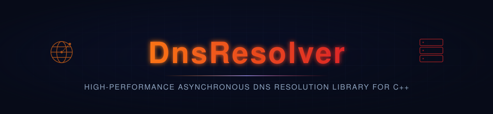

<p align="center">
  
</p>

<p align="center">
  
  
  
</p>

<p align="center">
  
</p>

<p align="center"><sub><b>CI / CD</b></sub></p>
<p align="center">
  <a href="https://github.com/privateMwb/DnsResolver/actions/workflows/build.yml">
    
  </a>
  <a href="https://github.com/privateMwb/DnsResolver/actions/workflows/benchmark.yml">
    
  </a>
  <a href="https://github.com/privateMwb/DnsResolver/actions/workflows/packaging.yml">
    
  </a>
  <a href="https://github.com/privateMwb/DnsResolver/actions/workflows/release.yml">
    
  </a>
</p>

<p align="center"><sub><b>Code Quality &amp; Safety</b></sub></p>
<p align="center">
  <a href="https://github.com/privateMwb/DnsResolver/actions/workflows/coverage.yml">
    
  </a>
  <a href="https://github.com/privateMwb/DnsResolver/actions/workflows/sanitizers.yml">
    
  </a>
  <a href="https://github.com/privateMwb/DnsResolver/actions/workflows/clang-tidy.yml">
    
  </a>
  <a href="https://github.com/privateMwb/DnsResolver/actions/workflows/clang-format.yml">
    
  </a>
  <a href="https://github.com/privateMwb/DnsResolver/actions/workflows/codeql.yml">
    
  </a>
  <a href="https://github.com/privateMwb/DnsResolver/actions/workflows/cflite_pr.yml">
    
  </a>
  <a href="https://www.bestpractices.dev/projects/14926">
    
  </a>
</p>

<p align="center"><sub><b>Documentation</b></sub></p>
<p align="center">
  <a href="https://github.com/privateMwb/DnsResolver/actions/workflows/docs.yml">
    
  </a>
</p>

<p align="center">
  
</p>

<p align="center"><sub><b>Compiler Support</b></sub></p>
<p align="center">
  
  
  
  
</p>

<p align="center">
  
</p>

<p align="center">DnsPro is a C++23 library for parsing, building, and resolving DNS messages against an in-memory authoritative zone — a typed, RFC 1035-conformant packet representation with correct compression-pointer handling (including loop and forward-pointer rejection), not a raw-bytes wrapper.</p>

<br>

## 📑 Table of Contents

- [Features](#features)
- [Requirements](#requirements)
- [Dependencies](#dependencies)
- [Installation](#installation)
- [Quick Start](#quick-start)
- [Project Structure](#project-structure)
- [Development](#development)
- [Benchmarks](#benchmarks)
- [Fuzzing](#fuzzing)
- [Documentation](#documentation)
- [Contributing](#contributing)
- [Changelog](#changelog)
- [Security](#security)
- [License](#license)

<br>

## <a id="features"></a>✨ Features

- **Nested `name → type → records` zone indexing** — `ZoneStore` indexes
  records as `HashMap<string, HashMap<uint16_t, Vector<ResourceRecord>>>`
  rather than a flat per-name list, so `lookup()` and `removeRecord()`
  stay independent of zone size — measured flat at ~144 ns/op whether
  the zone holds 100 or 10,000 names.
- **Compression-pointer loop detection that catches oscillation, not
  just backward jumps** — rejecting a pointer that targets its own or a
  later offset isn't sufficient on its own: a label that advances the
  cursor forward, followed by a pointer back to that label, still
  satisfies a naive "each hop must be backward" rule while looping
  forever. `Parser` bounds total hops with a step counter specifically
  to catch this class of malformed packet, not just the simpler
  forward-pointer case.
- **`Builder` never emits compression pointers, by design** — round-trip
  correctness only requires a rebuilt packet re-parse to an equivalent
  `Message`, not that it match another encoder's compression choices
  byte-for-byte; always writing full names keeps the encoder simple, at
  a real, measured wire-size cost documented in Benchmarks rather than
  an unmeasured one.
- **Zero-copy `Message` moves** — move-construct and move-assign cost
  ~5–10 ns regardless of how many questions or answer records a
  `Message` holds, since `Vector`'s move steals the underlying buffer
  pointer rather than copying elements.

<div align="right"><a href="#-table-of-contents"></a></div>

## <a id="requirements"></a>📋 Requirements

- A C++23-conformant compiler (tested: Clang, GCC, MSVC)
- CMake 3.20+
- Git submodules initialized — DnsPro is a consumer of its own
  `VectorPro`/`HashMapPro` libraries (see [Dependencies](#dependencies))
  and needs their source present to build from source

<div align="right"><a href="#-table-of-contents"></a></div>

## <a id="dependencies"></a>🔗 Dependencies

DnsPro is built entirely on this author's own libraries, vendored as git submodules under `libs/internal/`:

| Library | Provides | Repository |
|---|---|---|
| VectorPro | `Vector<T>`, backing `Message`'s question/answer/authority/additional sections and `ZoneStore`'s per-type record lists | [privateMwb/VectorPro](https://github.com/privateMwb/VectorPro) |
| HashMapPro | `HashMap<K,V>`, backing `ZoneStore`'s nested name→type→records index | [privateMwb/HashMapPro](https://github.com/privateMwb/HashMapPro) |

> `ArenaAllocator` is also vendored under `libs/internal/` but not yet
> wired up — every `Vector<T>` above currently uses the default heap
> allocator, not an arena-backed one. Left out of this table since
> nothing in the library code actually uses it yet.

<div align="right"><a href="#-table-of-contents"></a></div>

## <a id="installation"></a>📦 Installation

**From source:**

```bash
git clone --recurse-submodules https://github.com/privateMwb/DnsResolver.git
cd DnsResolver
cmake -B build \
  -DBUILD_TESTS=OFF \
  -DBUILD_BENCHMARKS=OFF \
  -DBUILD_REGRESSION=OFF \
  -DBUILD_EXAMPLES=OFF
cmake --install build
```

Then, in your own `CMakeLists.txt`:

```cmake
find_package(DnsPro CONFIG REQUIRED)
target_link_libraries(your_target PRIVATE DnsPro::DnsPro)
```

> vcpkg and Conan packages are built and verified (recipe in
> `packaging/recipes/dnspro/all/`, port in `packaging/vcpkg/ports/dnspro/`),
> but not yet published to the public registries. This section will be
> updated once they are.

<div align="right"><a href="#-table-of-contents"></a></div>

## <a id="quick-start"></a>🚀 Quick Start

**Answer a query against an in-memory zone:**

```cpp
#include <DnsPro/DnsResolver.h>

using namespace DnsPro;

int main() {
    ZoneStore zone;

    Packet::ResourceRecord record;
    record.name.labels.push_back("example");
    record.name.labels.push_back("com");
    record.type   = 1; // A
    record.rclass = 1; // IN
    record.ttl    = 3600;
    record.rdata.push_back(std::byte{93});
    record.rdata.push_back(std::byte{184});
    record.rdata.push_back(std::byte{216});
    record.rdata.push_back(std::byte{34});
    zone.addRecord(record);

    Resolver resolver(zone);

    std::span<const std::byte> query = /* raw bytes off the wire */;
    Vector<std::byte> response;
    if (resolver.resolve(query, response) == Status::OK) {
        // send `response` back over the wire
    }
}
```

**Parse a raw buffer and inspect its questions:**

```cpp
Packet::Message message;
if (Parser::parse(buffer, message) == Status::OK) {
    for (const auto& question : message.questions) {
        // question.qname.labels, question.qtype, question.qclass
    }
}
```

**Handle parse failures explicitly:**

```cpp
switch (Parser::parse(buffer, message)) {
    case Status::OK:               /* ... */ break;
    case Status::BUFFER_TOO_SMALL: /* truncated packet */ break;
    case Status::COMPRESSION_LOOP: /* malformed pointer chain */ break;
    default:                       /* ... */ break;
}
```

<div align="right"><a href="#-table-of-contents"></a></div>

## <a id="project-structure"></a>🗂️ Project Structure

```
DnsResolver/
├── include
│    └── DnsPro
│        ├── Builder.h
│        ├── DnsResolver.h
│        ├── Packet
│        │   ├── Header.h
│        │   ├── Message.h
│        │   ├── Name.h
│        │   ├── Question.h
│        │   └── ResourceRecord.h
│        ├── Parser.h
│        ├── Resolver.h
│        ├── Status.h
│        └── ZoneStore.h
│
├── src
│    └── DnsPro
│        ├── Builder.cpp
│        ├── Parser.cpp
│        ├── Resolver.cpp
│        └── ZoneStore.cpp
│
├── libs/
│   └── internal/                     # this project's own libraries, vendored
│       ├── VectorPro/                # as git submodules (see Dependencies)
│       ├── HashMapPro/
│       └── ArenaAllocator/
│
├── examples/
│   ├── CMakeLists.txt
│   ├── example_main.cpp
│   ├── README.md
│   ├── support/
│   └── suite/
│
├── tests/
│   ├── CMakeLists.txt
│   ├── README.md
│   ├── custom/                       # the project's own RUN/CHK framework
│   └── google/                       # the same suites, via GoogleTest
│
├── benchmarks/
│   ├── CMakeLists.txt
│   ├── README.md
│   ├── custom/                       # the project's own BENCH framework
│   └── google/                       # the same suites, via Google Benchmark
│
├── regression/                       # compares a benchmark run against
│   ├── CMakeLists.txt                # a saved baseline snapshot
│   ├── README.md
│   ├── custom/
│   ├── google/
│   └── results/
│
├── fuzz/
│   └── fuzz_parser.cpp
│
├── .clusterfuzzlite/
│   ├── Dockerfile
│   ├── build.sh
│   └── project.yaml
│
├── packaging/
│   ├── README.md
│   ├── requirements.in
│   ├── requirements.text
│   ├── recipes/
│   ├── vcpkg/
│   └── vcpkg-smoke-test/
│
├── scripts/
│   └── update_package_files.py
│
├── .github/
│   ├── releases/
│   ├── workflows/
│   └── dependabot.yml
│
├── cmake/
│   └── DnsProConfig.cmake.in
│
├── docs/
│   ├── Doxyfile
│   └── README.md
│
├── .clang-format
├── .clang-tidy
├── .gitignore
├── CMakeLists.txt
├── README.md
├── CONTRIBUTING.md
├── CHANGELOG.md
├── SECURITY.md
├── FUZZING.md
└── LICENSE
```

<div align="right"><a href="#-table-of-contents"></a></div>

## <a id="development"></a>🛠️ Development

The from-source install above builds the library only. To work on
DnsPro itself — running tests, benchmarks, or the regression
tool — build with everything enabled (the default):

```bash
cmake -B build
cmake --build build
```

**Run the test suite** (both the custom framework and GoogleTest):

```bash
ctest --test-dir build
```

**Run benchmarks and check for regressions:**

```bash
./build/benchmarks
./build/regression                  # latest baseline vs. benchmarks/results/benchmark_results.json
./build/regression v1.2.0           # a specific baseline vs. current
./build/regression v1.2.0 v1.4.0    # two baselines against each other
```

`regression` picks the latest baseline by semantic version (`v1.10.0`
correctly outranks `v1.9.0`), not alphabetical filename order, and
auto-names its output (`regression_v1.2.0_vs_current.md`/`.json`, etc.).

See [packaging/README.md](packaging/README.md) for notes on verifying the vcpkg
port and Conan recipe locally, and [FUZZING.md](FUZZING.md) for running the
fuzz harness locally.

<div align="right"><a href="#-table-of-contents"></a></div>

## <a id="benchmarks"></a>📊 Benchmarks

Solo-timed at 10K / 100K / 1M iterations — no reference implementation
exists to compare against (there's no standard-library or widely-used
DNS parser/zone-store to pair each benchmark with). Full dataset:
`benchmarks/baselines/v1.0.0.json`.

| Operation | DnsPro (1M) |
|---|---|
| `Parser::parse()` — query, single question | 62.97 ns/op |
| `Parser::parse()` — response, 4 answer records | 296.11 ns/op |
| `Builder::build()` — query, single question | 122.20 ns/op |
| `Builder::build()` — response, 4 answer records | 399.52 ns/op |
| `ZoneStore::lookup()` — existing name+type | 137.71 ns/op |
| `ZoneStore::lookup()` — missing name | 61.89 ns/op |
| `Resolver::resolve()` — answer found | 448.81 ns/op |
| `Resolver::resolve()` — NXDOMAIN | 360.46 ns/op |
| `Message` move-construct | 5.99 ns/op |
| Name parse — uncompressed | 63.46 ns/op |
| Name parse — via compression pointer | 96.05 ns/op |

`Resolver::resolve()` (360–449 ns/op) is the most expensive path
measured, unsurprising since it chains parse, zone lookup, and build
together — each stage individually stays under 400 ns/op, so the full
pipeline doesn't add overhead beyond the sum of its parts. A missing
name is actually *faster* to look up than an existing one (61.89 ns vs.
137.71 ns): a miss short-circuits at the outer name-level hash lookup,
while a hit has to additionally walk the inner `type → records` index.

The clearest trade-off is name compression: resolving a name through a
compression pointer costs ~51% more than an uncompressed name
(96.05 ns vs. 63.46 ns/op) — the one place decompression's cost shows
up directly rather than being amortized away. `ZoneStore::lookup()`
itself stays flat at ~144 ns/op from 100 names up to 10,000, confirming
the nested hash index does its job — zone size stops being a cost
variable in the lookup path.

<div align="right"><a href="#-table-of-contents"></a></div>

## <a id="fuzzing"></a>🐛 Fuzzing

`Parser::parse()`/`Builder::build()` are fuzzed via
[ClusterFuzzLite](https://google.github.io/clusterfuzzlite/), under
AddressSanitizer and UndefinedBehaviorSanitizer. A short pass runs on
every PR touching a fuzzed source file; a longer batch pass runs
nightly.

It isn't a differential fuzzer — there's no shadow-model DNS parser to
compare against. `fuzz_parser` instead checks the one correctness
property the library actually promises: a rebuilt packet re-parses to
an equivalent `Message`. For any input that parses successfully, it
parses → builds → reparses → builds again, and requires the second
build to be byte-identical to the first. This also, incidentally,
exercises every parse failure path a malformed packet can take —
truncated buffers, invalid label encodings, and compression-pointer
loops/forward pointers, the trickiest part of RFC 1035 to get right.

`ZoneStore`'s own API and full `Resolver::resolve()` end-to-end are
deliberately not fuzzed yet — both take already-parsed structures or
need a populated zone fixture rather than fitting the raw-bytes-in
harness model directly.

See [FUZZING.md](FUZZING.md) for running the harness locally and
reproducing a failing input.

<div align="right"><a href="#-table-of-contents"></a></div>

## <a id="documentation"></a>📖 Documentation

Full API reference, generated with Doxygen from `docs/Doxyfile`:

**https://privateMwb.github.io/DnsResolver/**

<div align="right"><a href="#-table-of-contents"></a></div>

## <a id="contributing"></a>🤝 Contributing

Issues and pull requests are welcome. Before submitting a PR:

- Run the test suite (`ctest --test-dir build`)
- If you're changing a hot path, run `./build/regression` and mention
  the results in your PR description
- If you're changing `Parser` or `Builder`, a quick local fuzz pass
  (see [FUZZING.md](FUZZING.md)) before pushing catches most
  malformed-input regressions before CI does

<div align="right"><a href="#-table-of-contents"></a></div>

## <a id="changelog"></a>📝 Changelog

See the [Releases](https://github.com/privateMwb/DnsResolver/releases)
page for version history and release notes.

<div align="right"><a href="#-table-of-contents"></a></div>

## <a id="security"></a>🔒 Security

Please don't report a suspected vulnerability in a public issue. Use
GitHub's private reporting instead — this repository's **Security** tab,
then **Report a vulnerability** — so it can be fixed before it's disclosed.

<div align="right"><a href="#-table-of-contents"></a></div>

## <a id="license"></a>📄 License

MIT — see [LICENSE](LICENSE) for details.

<p align="center">
  <sub>Built with C++23</sub>
</p>

<p align="center">
  <a href="#-table-of-contents"></a>
</p>
